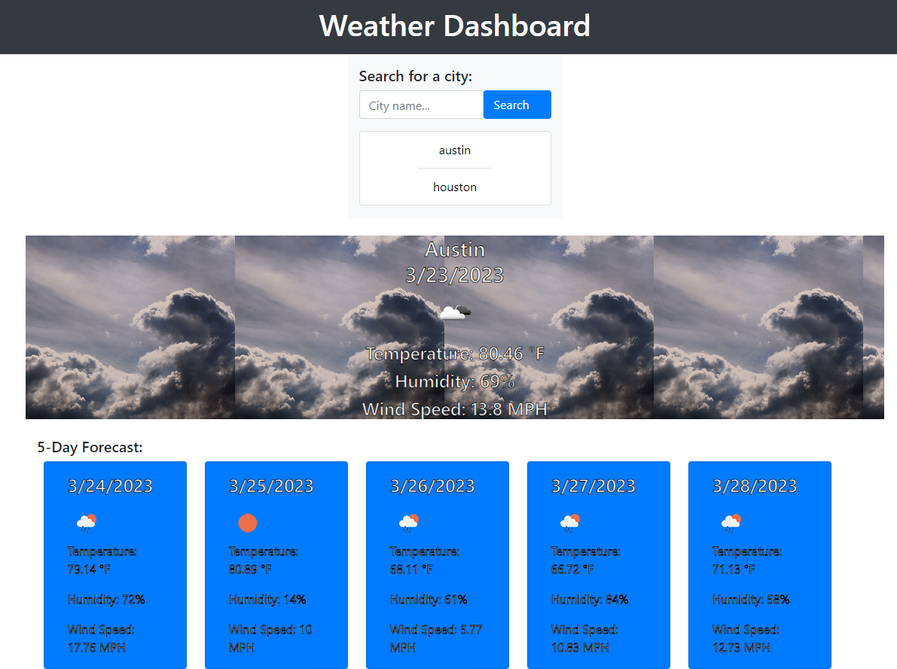

# Weather Dashboard
  
  
 

  ## Description
  With this application you will be able to find the current weather conditions for the city of your choosing along with the 5 day forecast. As you search for more cities, a list will appear. Then, you will be able to click on a city in your list to see that weather again.
  
  ## Table of Contents
  * [Description](#description)
  * [Installation](#installation)
  * [Usage](#usage)
  * [License](#license)
  * [Contribution](#contribution)
  * [Tests](#tests)
  * [Questions](#questions)
  

  ## Installation
  For this application to work, you just need an internet connection and a device with a browser.
  
  ## Usage
  Just enter the city name in the search box of the weather you want to know.

  Screenshot:

  ## License
  The license this project is under is MIT. For more information, please click the link below:

  https://opensource.org/licenses/MIT
  
  ## Contribution
  Feel free to reach out to me on GitHub.
  
  ## Tests
  You can either go to the live page, or clone my code and run the application on your own.
  
  ## Questions
  Any Questions? You can email me at willjaramillo30@gmail.com
  Or, reach out to me on GitHub at https://github/willj30
